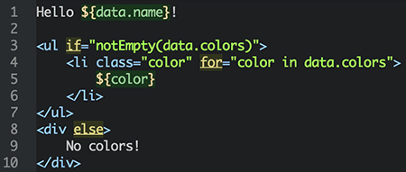

Marko
================
[](https://travis-ci.org/raptorjs/marko) [](https://gitter.im/raptorjs/marko?utm_source=badge&utm_medium=badge&utm_campaign=pr-badge&utm_content=badge)
[](https://nodei.co/npm/marko/)


Marko is an extensible, streaming, asynchronous, [high performance](https://github.com/raptorjs/templating-benchmarks), _HTML-based_ templating language that can be used in Node.js or in the browser. Marko was founded on the philosophy that an HTML-based templating language is more natural and intuitive for generating HTML.  Because the Marko compiler understands the structure of the HTML document, the directives in template files are less obtrusive and more powerful. In addition, Marko allows developers to introduce custom tags and custom attributes to extend the HTML grammar (much like [Web Components](http://www.html5rocks.com/en/tutorials/webcomponents/customelements/)—only you can use it now).

Marko is a perfect match for Node.js since it supports writing directly to an output stream so that HTML can be sent over the wire sooner. Marko automatically flushes around asynchronous fragments so that the HTML is delivered in the optimized number of chunks. Because Marko is an asynchronous templating language, additional data can be asynchronously fetched even after rendering has begun. These characteristics make Marko an excellent choice for creating high performance websites.

For building rich UI components with client-side behavior please check out the companion [marko-widgets](https://github.com/raptorjs/marko-widgets) taglib.

__[Try Marko Online!](http://raptorjs.org/marko/try-online/)__



Syntax highlighting available for [Atom](https://atom.io/) by installing the [language-marko](https://atom.io/packages/language-marko) package.


<!-- START doctoc generated TOC please keep comment here to allow auto update -->
<!-- DON'T EDIT THIS SECTION, INSTEAD RE-RUN doctoc TO UPDATE -->

# Table of Contents

- [Installation](#installation)
- [Sample Code](#sample-code)
- [Another Templating Language?](#another-templating-language)
- [Design Philosophy](#design-philosophy)
- [Usage](#usage)
	- [Template Rendering](#template-rendering)
		- [Callback API](#callback-api)
		- [Streaming API](#streaming-api)
		- [Synchronous API](#synchronous-api)
		- [Asynchronous Rendering API](#asynchronous-rendering-api)
	- [Browser-side Rendering](#browser-side-rendering)
		- [Using Lasso.js](#using-lassojs)
		- [Using Browserify](#using-browserify)
	- [Template Compilation](#template-compilation)
		- [Sample Compiled Template](#sample-compiled-template)
- [Language Guide](#language-guide)
	- [Template Directives Overview](#template-directives-overview)
	- [Text Replacement](#text-replacement)
	- [Expressions](#expressions)
	- [Includes](#includes)
	- [Variables](#variables)
	- [Conditionals](#conditionals)
		- [if...else-if...else](#ifelse-ifelse)
		- [Shorthand Conditionals](#shorthand-conditionals)
		- [Conditional Attributes](#conditional-attributes)
	- [Looping](#looping)
		- [for](#for)
			- [Loop Status Variable](#loop-status-variable)
			- [Loop Separator](#loop-separator)
			- [Range Looping](#range-looping)
			- [Property Looping](#property-looping)
			- [Custom Iterator](#custom-iterator)
	- [Macros](#macros)
		- [def](#def)
		- [invoke](#invoke)
	- [Structure Manipulation](#structure-manipulation)
		- [attrs](#attrs)
		- [body-only-if](#body-only-if)
	- [Comments](#comments)
	- [Whitespace](#whitespace)
	- [Helpers](#helpers)
	- [Global Properties](#global-properties)
	- [Custom Tags and Attributes](#custom-tags-and-attributes)
	- [Async Taglib](#async-taglib)
	- [Layout Taglib](#layout-taglib)
- [Custom Taglibs](#custom-taglibs)
	- [Tag Renderer](#tag-renderer)
	- [marko-taglib.json](#marko-taglibjson)
		- [Sample Taglib](#sample-taglib)
	- [Defining Tags](#defining-tags)
	- [Defining Attributes](#defining-attributes)
	- [Scanning for Tags](#scanning-for-tags)
	- [Nested Tags](#nested-tags)
	- [Taglib Discovery](#taglib-discovery)
- [FAQ](#faq)
- [Additional Resources](#additional-resources)
	- [Further Reading](#further-reading)
	- [Screencasts](#screencasts)
	- [Demo Apps](#demo-apps)
	- [Tools](#tools)
- [Changelog](#changelog)
- [Discuss](#discuss)
- [Contributors](#contributors)
- [Contribute](#contribute)
- [License](#license)

<!-- END doctoc generated TOC please keep comment here to allow auto update -->

# Installation

To install the `marko` module into your project you should use the following command:

```bash
npm install marko --save
```

To install the optional `markoc` command line interface to compile templates you can use the following command:

```bash
npm install marko --global
```

# Sample Code

A basic template with text replacement, looping and conditionals is shown below:

```xml
Hello ${data.name}!

<ul if="notEmpty(data.colors)">
    <li style="color: $color" for="color in data.colors">
        $color
    </li>
</ul>
<div else>
    No colors!
</div>
```

The template can then be rendered as shown in the following sample code:

```javascript
var templatePath = require.resolve('./hello.marko');
var template = require('marko').load(templatePath);

template.render({
        name: 'World',
        colors: ["red", "green", "blue"]
    },
    function(err, output) {
        console.log(output);
    });
```

The output of running the above program will be the following (formatted for readability):

```xml
Hello World!

<ul>
    <li>red</li>
    <li>green</li>
    <li>blue</li>
</ul>
```

For comparison, given the following data consisting of an empty array of colors:

```javascript
{
    name: 'World',
    colors: []
}
```

The output would be the following:

```xml
Hello World!

<div>No colors!</div>
```

The streaming API can be used to stream the output to an HTTP response stream or any other writable stream. For example, with Express:

```javascript
var template = require('marko').load(require.resolve('./template.marko'));

app.get('/profile', function(req, res) {
    template.stream({
            name: 'Frank'
        })
        .pipe(res);
});
```

Marko also supports custom tags so you can easily extend the HTML grammar to support things like the following:

```xml
Welcome to Marko!

<ui-tabs>
    <ui-tab title="Home">
        Content for Home
    </ui-tab>
    <ui-tab title="Profile">
        Content for Profile
    </ui-tab>
    <ui-tab title="Messages">
        Content for Messages
    </ui-tab>
</ui-tabs>
```

The above template is a very simple way to generate the much more complicated HTML output shown below:

```xml
<div class="tabs">
    <ul class="nav nav-tabs">
        <li class="active">
            <a href="#tab0" data-toggle="tab">Home</a>
        </li>
        <li>
            <a href="#tab1" data-toggle="tab">Profile</a>
        </li>
        <li>
            <a href="#tab2" data-toggle="tab">Messages</a>
        </li>
    </ul>
    <div class="tab-content">
        <div id="tab0" class="tab-pane active">
            Content for Home
        </div>
        <div id="tab1" class="tab-pane">
            Content for Profile
        </div>
        <div id="tab2" class="tab-pane">
            Content for Messages
        </div>
    </div>
</div>
```

The custom tags encapsulate rendering logic and help avoid repeating the same HTML (and potentially the same mistakes).

# Another Templating Language?

Most front-end developers are familiar with, and comfortable with, templating languages such as [Handlebars](https://github.com/wycats/handlebars.js), [Dust](https://github.com/linkedin/dustjs) or [Mustache](http://mustache.github.io/) so why was Marko introduced?

What makes Marko different is that it is an HTML-based templating language that does not rely on a custom language grammar. Any HTML file is a valid Marko template and vice-versa, and the Marko compiler uses an [off-the-shelf HTML parser](https://github.com/fb55/htmlparser2). Because Marko understands the HTML structure of the templates, it can do more powerful things that would not be possible in a text-based templating languages such as Handlerbars, Dust or Mustache. Marko allows developers to _extend the HTML language_ by introducing custom HTML elements and attributes. On top of that, utilizing the HTML structure for applying templating directives makes templates more readable and allows data templates to more closely resemble the final HTML structure.

Let's compare Marko with Handlebars (a text-based templating language):

__Handlebars:__

```xml
Hello {{name}}!

{{#if colors}}
<ul>
    {{#each colors}}
    <li class="color">
        {{this}}
    </li>
    {{/each}}
</ul>
{{else}}
<div>
    No colors!
</div>
{{/if}}
```

__Marko:__

```xml
Hello ${data.name}!

<ul if="notEmpty(data.colors)">
    <li class="color" for="color in data.colors">
        ${color}
    </li>
</ul>
<div else>
    No colors!
</div>
```

A few things to note for the Marko template:

* Less lines of code
* Less lines are "touched" to make the template dynamic
* Only opening tags are modified for conditionals and looping

Beyond Marko being an HTML-based templating language, it was also designed with extreme performance and extensibility in mind. The Marko compiler gives developers full control over how templates are compiled to JavaScript and the runtime was designed to be as efficient as possible. Marko fully embraces the JavaScript language for better performance and flexibility (e.g. favoring JavaScript expressions over a custom expression language).

Finally, another distinguishing feature of Marko is that it supports _asynchronous template rendering_. This powerful feature allows portions of the template to be rendered asynchronously. Instead of waiting for all data to come back from remote services before beginning to render the template, you can now immediately start rendering the template and the portions of the template that depend on asynchronous data will render as soon as the asynchronous data becomes available. The Marko rendering engine ensures that the final HTML will be streamed out in the correct order.

# Design Philosophy

* __Readable:__ Templates should be as close to the output HTML as possible to keep templates readable. Cryptic syntax and symbols should be avoided.
* __Simple:__ The number of new concepts should be minimized and complexity should be avoided.
* __Extensible:__ The template engine should be easily extensible at both compile-time and runtime.
* __High Performance:__ Runtime and compiled output should be optimized for low CPU and memory usage and have a small footprint. All expressions should be native JavaScript to avoid runtime interpretation.
* __Not Restrictive:__ Whether or not to go less logic or more logic is up to the developer.
* __Asynchronous and Streaming Output:__ It should be possible to render HTML out-of-order, but the output HTML should be streamed out in the correct order. This minimizes idle time and reduces the time to first byte.
* __Intuitive:__ The templating engine should introduce as few surprises as possible.
* __Browser and Server Compatibility:__ Templates should compile down to JavaScript that can be executed on both the server and the client.
* __Debuggable:__ Compiled JavaScript should be debuggable and readable.
* __Compile-Time Checks:__ Syntax, custom tags and custom attributes should be validated at compile-time.
* __Tools Support:__ Tools should be enabled to offer auto-completion and validation for improved productivity and safety.
* __Modular:__ Runtime and compiled templates should be based on CommonJS modules for improved dependency management. Template dependencies (such as custom tags) should be resolved based on a template's file system path instead of relying on a shared registry.

# Usage

## Template Rendering

### Callback API

```javascript
var template = require('marko').load('template.marko');

template.render({
        name: 'Frank',
        count: 30
    },
    function(err, output) {
        if (err) {
            console.error('Rendering failed');
            return;
        }

        console.log('Output HTML: ' + output);
    });
```

### Streaming API

```javascript
var template = require('marko').load('template.marko');
var out = require('fs').createWriteStream('index.html', 'utf8');

// Render the template to 'index.html'
template.stream({
        name: 'Frank',
        count: 30
    })
    .pipe(out);
```

Alternatively, you can render directly to an existing stream to avoid creating an intermediate stream:

```javascript
var template = require('marko').load('template.marko');
var out = require('fs').createWriteStream('index.html', 'utf8');

// Render the template to 'index.html'
template.render({
        name: 'Frank',
        count: 30
    }, out);
```
_NOTE:_ This will end the target output stream.

### Synchronous API

If you know that your template rendering requires no asynchronous rendering then you can use the synchronous API to render a template to a String:

```javascript
var template = require('marko').load('template.marko');

var output = template.renderSync({
        name: 'Frank',
        count: 30
    });
console.log('Output HTML: ' + output);
```

### Asynchronous Rendering API

```javascript
var fs = require('fs');
var marko = require('marko');
var template = marko.load('template.marko');

var out = marko.createWriter(fs.createWriteStream('index.html', 'utf8'));

// Render the first chunk asynchronously (after 1s delay):
var asyncOut = out.beginAsync();
setTimeout(function() {
    asyncOut.write('BEGIN ');
    asyncOut.end();
}, 1000);

// Render the template to the original writer:
template.render({
        name: 'World'
    },
    out);

// Write the last chunk synchronously:
out.write(' END');

// End the rendering out
out.end();
```

Despite rendering the first chunk asynchronously, the above program will stream out the output in the correct order to `index.html`:

```xml
BEGIN Hello World! END
```

For more details, please see the documentation for the [async-writer](https://github.com/raptorjs/async-writer) module.

## Browser-side Rendering

Given the following module code that will be used to render a template on the client-side:

_run.js_:
```javascript

var templatePath = require.resolve('./hello.marko');
var template = require('marko').load(templatePath);

templatePath.render({
        name: 'John'
    },
    function(err, output) {
        document.body.innerHTML = output;
    });
```

You can then bundle up the above program for running in the browser using either [Lasso.js](https://github.com/lasso-js/lasso) (recommended) or [browserify](https://github.com/substack/node-browserify).


### Using Lasso.js

The `lasso` CLI can be used to generate resource bundles that includes all application modules and all referenced Marko template files using a command similar to the following:
```bash
# First install the lasso and the lasso-marko plugin
npm install lasso --global
npm install lasso-marko

lasso --main run.js --name my-page --plugins lasso-marko
```

This will produce a JSON file named `build/my-page.html.json` that contains the HTML markup that should be used to include the required JavaScript and CSS resources that resulted from the page optimization.

Alternatively, you can inject the HTML markup into a static HTML file using the following command:

```bash
lasso --main run.js --name my-page --plugins lasso-marko --inject-into my-page.html
```


### Using Browserify

The `markoify` transform for browserify must be enabled in order to automatically compile and include referenced Marko template files.

```bash
# Install the markoify plugin from npm:
npm install markoify --save

# Build the browser bundle:
browserify -t markoify run.js > browser.js
```


## Template Compilation

The Marko compiler produces a Node.js-compatible, CommonJS module as output. This output format has the advantage that compiled template modules can benefit from a context-aware module loader and templates can easily be transported to work in the browser using [Lasso.js](https://github.com/lasso-js/lasso) or [Browserify](https://github.com/substack/node-browserify).

The `marko` module will automatically compile templates loaded by your application on the server, but you can also choose to precompile all templates. This can be helpful as a build or test step to catch errors early.

You can either use the command line interface or the JavaScript API to compile a Marko template file. To use the CLI you must first install the `marko` module globally using the following command:
```bash
npm install marko --global
```

You can then compile single templates using the following command:
```bash
markoc hello.marko
```

This will produce a file named `hello.marko.js` next to the original file.

You can also recursively compile all templates in the current directory (the `node_modules` and `.*` directories will be ignored by default)

```bash
markoc .
```

You can also specify multiple directories or files
```bash
markoc foo/ bar/ template.marko
```

To delete all of the generated `*.marko.js` files you can add the `--clean` argument. For example:
```bash
markoc . --clean
```


Alternatively, you can use the JavaScript API to compile a module as shown in the following sample code:
```javascript
require('marko/compiler').compileFile(path, function(err, src) {
    // Do something with the compiled output
});
```

### Sample Compiled Template
```javascript
exports.create = function(__helpers) {
  var empty = __helpers.e,
      notEmpty = __helpers.ne,
      escapeXml = __helpers.x,
      forEach = __helpers.f,
      escapeXmlAttr = __helpers.xa;

  return function render(data, out) {
    out.w('Hello ' +
      escapeXml(data.name) +
      '! ');

    if (notEmpty(data.colors)) {
      out.w('<ul>');

      forEach(data.colors, function(color) {
        out.w('<li style="color: ' +
          escapeXmlAttr(color) +
          '">' +
          escapeXml(color) +
          '</li>');
      });

      out.w('</ul>');
    }
    else {
      out.w('<div>No colors!</div>');
    }
  };
}
```

The compiled output is designed to be both extremely readable and minifiable. The minified code is shown below:


```javascript
exports.create=function(a){var d=a.ne,c=a.x,e=a.f,f=a.xa;return function(a,b){b.w("Hello "+c(a.name)+"! ");d(a.colors)?(b.w("<ul>"),e(a.colors,function(a){b.w('<li style="color: '+f(a)+'">'+c(a)+"</li>")}),b.w("</ul>")):b.w("<div>No colors!</div>")}};
```

_File size: 189 bytes gzipped (251 bytes uncompressed)_

# Language Guide

## Template Directives Overview

Almost all of the Marko templating directives can be used as either an attribute or as an element. For example:

_Applying directives using attributes:_
```xml
<!-- Colors available -->
<ul if="notEmpty(colors)">
    <li for="color in colors">
        $color
    </li>
</ul>

<!-- No colors available -->
<div if="empty(colors)">
    No colors!
</div>
```

_Applying directives using elements:_
```xml
<!-- Colors available -->
<if test="notEmpty(colors)">
    <ul>
        <for each="color in colors">
            <li>
                $color
            </li>
        </for>
    </ul>
</if>

<!-- No colors available -->
<if test="empty(colors)">
    <div>
        No colors!
    </div>
</if>
```

The disadvantage of using elements to control structural logic is that they change the nesting of the elements which can impact readability. For this reason it is often more suitable to apply directives as attributes.

## Text Replacement

Dynamic text is supported using either `$<variable-reference>` or `${<javascript-expression>}`.

Examples:
```xml
Hello $data.name!
Hello ${data.name}!
Hello ${data.name.toUpperCase()}!
```

By default, all special HTML characters will be escaped in dynamic text to prevent Cross-site Scripting (XSS) Attacks. To disable HTML escaping, you can use `$!` as shown in the following sample code:

```xml
Hello $!{data.name}! <!-- Do not escape -->
```

If necessary, you can escape `$` using a forward slash to have it be treated as text instead of a placeholder token:

```xml
Test: \${hello}
<!-- Rendered Ouptut:
Test: ${hello}
-->
```

## Expressions

Wherever expressions are allowed, they are treated as JavaScript expressions and copied out to the compiled template verbatim. However, you can choose to use alternate versions of the following JavaScript operators:

JavaScript Operator | Marko Equivalent
------------------- | -----------------
`&&`                 | `and`
<code>&#124;&#124;</code>                | `or`
`===`               | `eq`
`!==`               | `ne`
`<`                 | `lt`
`>`                 | `gt`
`<=`                | `le`
`>=`                | `ge`

For example, both of the following are valid and equivalent:

```xml
<div if="searchResults.length > 100">
    Show More
</div>
```

```xml
<div if="searchResults.length gt 100">
    Show More
</div>
```

## Includes

Other Marko files can be included using the `<include>` tag and a relative path. For example:

```xml
<include template="./greeting.marko" name="Frank" count="30"/>
```

## Variables

Input data passed to a template is made available using a special `data` variable. It's possible to declare your own variables as shown in the following sample code:

```xml
<var name="name" value="data.name.toUpperCase()" />
```

To assign a new value to an existing variable the `<assign>` tag can be used as shown in the following sample code:

```xml
<assign var="name" value="data.name.toLowerCase()" />
```

The `<with>` directive can be used to create scoped variables as shown in the following sample code:

```xml
<with vars="nameUpper=data.name.toUpperCase(); nameLower=data.name.toLowerCase()">
    Hello $nameUpper!
    Hello $nameLower!
</with>
```

## Conditionals

### if...else-if...else

Any element or fragment of HTML can be made conditional using the `if`, `else-if` or `else` directive.

_Applied as attributes:_
```xml
<!--Simple if-->
<div if="someCondition">
    Hello World
</div>

<!--Complex if-->
<div if="test === 'a'">
    A
</div>
<div else-if="test === 'b'">
    B
</div>
<div else-if="test === 'c'">
    C
</div>
<div else>
    Something else
</div>
```

_Applied as elements:_
```xml
<!-- Colors available -->
<!--Simple if-->
<if test="someCondition">
    <div>
        Hello World
    </div>
</if>

<!--Complex if-->
<if test="test === 'a'">
    <div>
        A
    </div>
</if>
<else-if test="test === 'b'">
    <div>
        B
    </div>
</else-if>
<else-if test="test === 'c'">
    <div>
        C
    </div>
</else-if>
<else>
    <div>
        Something else
    </div>
</else>
```

### Shorthand Conditionals

Shorthand conditionals allow for conditional values inside attributes or wherever expressions are allowed. Shorthand conditionals are of the following form:
`{?<expression>;<true-template>[;<false-template>]}`

For example:

```xml
<div class="{?active;tab-active}">Hello</div>
```
With a value of `true` for `active`, the output would be the following:

```xml
<div class="tab-active">Hello</div>
```

With a value of `false` for `active`, the output would be the following:

```xml
<div>Hello</div>
```

_NOTE: If the expression inside an attribute evaluates to `null` or an empty string then the attribute is not included in the output._

As shown in the previous example, the "else" block for shorthand conditionals is optional. The usage of an else block is shown below:

```xml
<div class="{?active;tab-active;tab-inactive}">Hello</div>
```

With a value of `false` for `active`, the output would be the following:

```xml
<div class="tab-inactive">Hello</div>
```

### Conditional Attributes

Marko supports conditional attributes when the value of an attribute is an expression. Marko also supports [HTML `boolean` attributes](https://html.spec.whatwg.org/#boolean-attributes) (e.g., `<input type="checkbox" checked>`)  If an attribute value resolves to `null`, `undefined`, `false`  or an empty string then the attribute will not be rendered. If an attribute value resolves to `true` then only the attribute name will rendered.

For example, given the following data:

```javascript
{
    title: '',
    active: true,
    checked: false,
    disabled: true
}
```

And the following template:

```xml


<div class="{?data.active;tab-active}"></div>

<input type="checkbox"
    checked="${data.checked}"
    disabled="${data.disabled}">
```

The output HTML will be the following:

```xml


<div></div>

<input type="checkbox" disabled>
```

## Looping

### for

Any element can be repeated for every item in an array using the `for` directive. The directive can be applied as an element or as an attribute.

_Applied as an attribute:_

```xml
<ul>
    <li for="item in items">${item}</li>
</ul>
```

_Applied as an element:_

```xml
<ul>
    <for each="item in items">
        <li>${item}</li>
    </for>
</ul>
```


Given the following value for items:

```javascript
["red", "green", "blue"]
```

The output would be the following:

```xml
<ul>
    <li>red</li>
    <li>green</li>
    <li>blue</li>
</ul>
```

#### Loop Status Variable

The `for` directive also supports a loop status variable in case you need to know the current loop index. For example:

```xml
<ul>
    <li for="color in colors; status-var=loop">
        ${loop.getIndex()+1}) $color
        <if test="loop.isFirst()"> - FIRST</if>
        <if test="loop.isLast()"> - LAST</if>
    </li>
</ul>
```

#### Loop Separator

```xml
<for each="color in colors" separator=", ">$color</for>

<div>
    <span for="color in colors; separator=', '" style="color: $color">$color</span>
</div>
```

#### Range Looping

A range can be provided in the following format; `<var-name> from <from> to <to>[ step <step>]`.

The `from`, `to` and `step` values must be numerical expressions. If not specified, step defaults to 1.

```xml
<ul>
    <li for="i from 0 to 10">
        $i
    </li>
</ul>
```

```xml
<ul>
    <li for="i from 0 to 10 step 2">
        $i
    </li>
</ul>
```

```xml
<ul>
    <li for="i from 0 to myArray.length-1">
        ${myArray[i]}
    </li>
</ul>
```


#### Property Looping

```xml
<ul>
    <li for="(name,value) in settings">
        <b>$name</b>:
        $value
    </li>
</ul>
```

#### Custom Iterator

A custom iterator function can be passed as part of the view model to the template to control looping over data.


A sample custom iterator function that loops over an array in reverse is shown below:

```javascript
{
    reverseIterator: function(arrayList, callback) {
        for(var i=arrayList.length-1; i>=0; i--){
            callback(arrayList[i]);
        }
    }
}
```

The custom iterator can then be used in a template as shown below:

_Applied as part of a `for` attribute:_

```xml
<div for="item in ['a', 'b', 'c']; iterator=data.reverseIterator">
    $item
</div>
<!--
Output:
<div>c</div><div>b</div><div>a</div>
-->
```

_Applied as part of a `<for>` element:_

```xml
<for each="item in ['a', 'b', 'c']" iterator="data.reverseIterator">
    $item
</for>
<!--
Output:
cba
-->
```

Custom iterators also support providing a custom status object for each loop iteration:

```javascript
{
    reverseIterator: function(arrayList, callback){
        var statusVar = {first: 0, last: arrayList.length-1};
        for(var i=arrayList.length-1; i>=0; i--){
            statusVar.index = i;
            callback(arrayList[i], statusVar);
        }
    }
}
```

_Applied as part of a `for` attribute:_

```xml
<div for="item in ['a', 'b', 'c']; iterator=data.reverseIterator; status-var=status">
    ${status.index}$item
</div>
<!--
Output:
<div>2c</div><div>1b</div><div>0a</div>
-->
```

_Applied as part of a `<for>` element:_

```xml
<for each="item in ['a', 'b', 'c']" iterator="data.reverseIterator" status-var="status">
    ${status.index}$item
</for>
<!--
Output:
2c1b0a
-->
```

## Macros

Parameterized macros allow for reusable fragments within an HTML template. A macro can be defined using the `<def>` directive.

### def

The `<def>` directive can be used to define a reusable function within a template.

```xml
<def function="greeting(name, count)">
    Hello $name! You have $count new messages.
</def>
```

The above macro can then be invoked as part of any expression. Alternatively, the [`<invoke>`](#invoke) directive can be used invoke a macro function using named attributes. The following sample template shows how to use macro functions inside expressions:

```xml
<def function="greeting(name, count)">
    Hello $name! You have $count new messages.
</def>

<p>
    ${greeting("John", 10)}
</p>
<p>
    ${greeting("Frank", 20)}
</p>
```

### invoke

The `<invoke>` directive can be used to invoke a function defined using the `<def>` directive or a function that is part of the input data to a template. The `<invoke>` directive allows arguments to be passed using element attributes, but that format is only supported for functions that were previously defined using the `<def>` directive.

```xml
<def function="greeting(name, count)">
    Hello ${name}! You have ${count} new messages.
</def>

<invoke function="greeting" name="John" count="${10}"/>
<invoke function="greeting('Frank', 20)"/>
```

The output for the above template would be the following:

```xml
<p>
    Hello John! You have 10 new messages.
</p>
<p>
    Hello Frank! You have 20 new messages.
</p>
```

_NOTE:_ By default, the arguments will be of type "string" when using `<invoke>.` However, argument attributes support JavaScript expressions which allow for other types of arguments. Example:
```xml
count="10" <!-- string argument -->
count="${10}"  <!-- number argument -->
```


## Structure Manipulation

### attrs

The `attrs` attribute allows attributes to be dynamically added to an element at runtime. The value of the attrs attribute should be an expression that resolves to an object with properties that correspond to the dynamic attributes. For example:

```xml
<div attrs="myAttrs">
    Hello World!
</div>
```

Given the following value for the `myAttrs` variable:

```javascript
{style: "background-color: #FF0000;", "class": "my-div"}
```

The output would then be the following:

```xml
<div style="background-color: #FF0000;" class="my-div">
    Hello World!
</div>
```

### body-only-if

If you find that you have a wrapper element that is conditional, but whose body should always be rendered then you can use the `body-only-if` attribute to handle this use case. For example, to only render a wrapping `<a>` tag if there is a valid URL then you could do the following:

```xml
<a href="${data.linkUrl}" body-only-if="!data.linkUrl">
    Some body content
</a>
```

Given a value of `"http://localhost/"` for the `data.linkUrl` variable: , the output would be the following:

```xml
<a href="http://localhost/">
    Some body content
</a>
```

Given a value of `undefined` for the `data.linkUrl` variable: , the output would be the following:

```xml
Some body content
```

## Comments

Standard HTML comments can be used to add comments to your template. The HTML comments will not show up in the rendered HTML.

Example comments:

```xml
<!-- This is a comment that will not be rendered -->
<h1>Hello</h1>
```

If you would like for your HTML comment to show up in the final output then you can use the custom `html-comment` tag:
```xml
<html-comment>This is a comment that *will* be rendered</html-comment>
<h1>Hello</h1>
```

Output:

```xml
<!--This is a comment that *will* be rendered-->
<h1>Hello</h1>
```

## Whitespace

The Marko compiler will remove unnecessary whitespace based on some builtin rules, by default. These rules are partially based on the rules that browser's use to normalize whitespace and partially based on the goal of allowing nicely indented markup with minified output. These rules are as follows:

- For text before the first child element: `text.replace(/^\n\s*/g, '')`
- For text after the last child element: `text.replace(/\n\s*$/g, '')`
- For text between child elements: `text.replace(/^\n\s*$/g, '')`
- Any contiguous sequence of whitespace characters is collapsed into a single space character

In addition, whitespace within the following tags is preserved by default:

- `<pre>`
- `<textarea>`
- `<script>`

Example template:

```xml
<div>
    <a href="/home">
        Home
    </a>
    <a href="/Profile">
        My   Profile
    </a>
    <textarea>
Hello
World</textarea
</div>
```

Example output:

```xml
<div><a href="/home">Home</a><a href="/Profile">My Profile</a><textarea>
Hello
World</textarea</div>
```

The following options are available to control whitespace removal:

__Option 1)__ Disable whitespace removal using the `compiler-options` tag:

```xml
<compiler-options whitespace="preserve" />
<div>
    
    
</div>
```

__Option 2)__ Disable whitespace removal using the `c-whitespace` attribute:

```xml
<div c-whitespace="preserve">
    
    
</div>
```

__Option 3)__ Disable _all_ whitespace removal by changing a compiler option

```javascript
require('marko/compiler').defaultOptions.preserveWhitespace = true;
```

__Option 4)__ Control whitespace removal for specific tags

```javascript
require('marko/compiler').defaultOptions.preserveWhitespace = {
    'pre': true,
    'textarea': true,
    'script': true
};
```

__Option 5)__ Configured a custom tag to preserve whitespace

Adding the `"preserve-whitespace": true` property to a tag definition will result in the Marko compiler preserving whitespace wherever that tag is encountered in a template.

## Helpers

Since Marko template files compile into CommonJS modules, any Node.js module can be "imported" into a template for use as a helper module. For example, given the following helper module:

_src/util.js_:
```javascript
exports.reverse = function(str) {
    var out = "";
    for (var i=str.length-1; i>=0; i--) {
        out += str.charAt(i);
    }
    return out;
};
```

The above module can then be imported into a template as shown in the following sample template:

_src/template.marko_:

```xml
<require module="./util" var="util" />

<div>${util.reverse('reverse test')}</div>
```

It's also possible to pass helper functions to a template as part of the view model:


```javascript
var template = require('marko').load(require.resolve('./template.marko'));

template.render({
        reverse: function(str) {
            var out = "";
            for (var i=str.length-1; i>=0; i--) {
                out += str.charAt(i);
            }
            return out;
        }
    },
    function(err, html) { ... });
```

Usage inside template:

```xml
<div>${data.reverse('reverse test')}</div>
```

## Global Properties

The `$global` property is used to add data that is available to all templates encountered during rendering by having the data hang off the wrapped writer.

```javascript
template.render({
    $global: {
        name: 'Frank'
    }
}, res);
```

Given the following template:

```xml
<div>
    Hello ${out.global.name}!
</div>
```

The output would be the following:

```xml
<div>
    Hello Frank
</div>
```

## Custom Tags and Attributes

Marko supports extending the language with custom tags and attributes. A custom tag or a custom attribute __must have at least one dash__ to indicate that is not part of the standard HTML grammar.

Below illustrates how to use a simple custom tag:

```xml
<div>
    <my-hello name="World"/>
</div>
```

The output of the above template might be the following:

```xml
<div>
    Hello World!
</div>
```

For information on how to use and create taglibs, please see the [Custom Taglibs](#custom-taglibs) section below.

## Async Taglib

The async taglib allows portions of your template to be rendere asynchronously. An asynchronous fragment can be bound to a function that accepts an "args" objects and callback argument. When the data provider function completes and invokes the callback with the resulting data, the body of the async fragment is then rendered with the asynchronous data assigned to the specified variable. Asynchronous fragments allow parts of your page to render out-of-order while still providing the final HTML in the correct order.

Example:

```javascript
template.render({
        userProfileDataProvider: function(arg, callback) {
            var userId = arg.userId;
            userProfileService.getUserProfile(userId, callback);
        }
    }, ...);
```

```xml
<async-fragment data-provider="data.userProfileDataProvider"
    var="userProfile"
    arg-userId="${data.userId}">

    <ul>
        <li>
            First name: ${userProfile.firstName}
        </li>
        <li>
            Last name: ${userProfile.lastName}
        </li>
        <li>
            Email address: ${userProfile.email}
        </li>
    </ul>

</async-fragment>
```

For more details, please see [https://github.com/raptorjs/marko-async](https://github.com/raptorjs/marko-async).

## Layout Taglib

Marko provides a `layout` taglib to support separating out layout from content. The usage of of the `layout` taglib is shown in the sample code below:

_default-layout.marko:_

```xml
<!doctype html>
<html lang="en">
<head>
    <meta charset="UTF-8">
    <title><layout-placeholder name="title"/></title>
</head>
<body>
    <h1 if="data.showHeader !== false">
        <layout-placeholder name="title"/>
    </h1>
    <p>
        <layout-placeholder name="body"/>
    </p>
    <div>
        <layout-placeholder name="footer">
            Default Footer
        </layout-placeholder>
    </div>
</body>
</html>
```

_Usage of `default-layout.marko`:_

```xml
<layout-use template="./default-layout.marko" show-header="$true">
    <layout-put into="title">My Page</layout-put>
    <layout-put into="body">BODY CONTENT</layout-put>
</layout-use>
```


For more details, please see [https://github.com/raptorjs/marko-layout](https://github.com/raptorjs/marko-layout).

# Custom Taglibs


## Tag Renderer

Every tag should be mapped to an object with a "render" function. The render function is just a function that takes two arguments: `input` and `out`. The `input` argument is an arbitrary object that contains the input data for the renderer. The `out` argument is an [asynchronous writer](https://github.com/raptorjs/async-writer) that wraps an output stream. Output can be produced using `out.write(someString)` There is no class hierarchy or tie-ins to Marko when implementing a tag renderer. A simple tag renderer is shown below:

```javascript
exports.render = function(input, out) {
    out.write('Hello ' + input.name + '!');
}
```

If, and only if, a tag has nested content, then a special `renderBody` method will be added to the `input` object. If a renderer wants to render the nested body content then it must call the `renderBody` method. For example:

```javascript
exports.render = function(input, out) {
    out.write('BEFORE BODY');
    if (input.renderBody) {
        input.renderBody(out);
    }
    out.write('AFTER BODY');
}
```

A tag renderer should be mapped to a custom tag by creating a `marko-taglib.json` as shown in the next few sections.

## marko-taglib.json

### Sample Taglib

```json
{
    "tags": {
        "my-hello": {
            "renderer": "./hello-renderer",
            "attributes": {
                "name": "string"
            }
        }
    }
}
```

Marko also supports a short-hand for declaring tags and attributes. The following `marko-taglib.json` is equivalent to the `marko-taglib.json` above:

```json
{
    "<my-hello>": {
        "renderer": "./hello-renderer",
        "@name": "string"
    }
}
```

The short-hand will be used for the remaining of this documentation.

## Defining Tags

Tags can be defined by adding `"<tag_name>": <tag_def>` properties to your `marko-taglib.json`:

```json
{
    "<my-hello>": {
        "renderer": "./hello-renderer",
        "@name": "string"
    },
    "<my-foo>": {
        "renderer": "./foo-renderer",
        "@*": "string"
    },
    "<my-bar>": "./path/to/my-bar/marko-tag.json",
    "<my-baz>": {
        "template": "./baz-template.marko"
    },
}
```

Every tag should be associated with a renderer or a template. When a custom tag is used in a template, the renderer (or template) will be invoked at render time to produce the HTML/output. If a `String` path to a `marko-tag.json` for a custom tag then the target `marko-tag.json` is loaded to define the tag.

## Defining Attributes

If you provide attributes then the Marko compiler will do validation to make sure only the supported attributes are provided. A wildcard attribute (`"@*"`) allows any attribute to be passed in. Below are sample attribute definitions:

_Multiple attributes:_

```javascript
{
    "@message": "string",     // String
    "@my-data": "expression", // JavaScript expression
    "@*": "string"            // Everything else will be added to a special "*" property
}
```

## Scanning for Tags

Marko supports a directory scanner to make it easier to maintain a taglib by introducing a few conventions:

* The name of the tag directory will be the name of the tag
* One tag per directory
* All tag directories should be direct children of a parent directory
* Every tag directory must contain a `renderer.js` that is used as the tag renderer or, alternatively, a `template.marko`
* Each tag directory may contain a `marko-tag.json` file or the tag definition can be embedded into `renderer.js`

With this approach, `marko-taglib.json` will be much simpler:

```json
{
    "tags-dir": "./components"
}
```
Given the following directory structure:

* __components/__
    * __my-hello/__
        * renderer.js
    * __my-foo/__
        * template.marko
    * __my-bar/__
        * renderer.js
        * marko-tag.json
* marko-taglib.json

The following three tags will be exported:

* `<my-hello>`
* `<my-foo>`
* `<my-bar>`

Directory scanning only supports one tag per directory and it will only look at directories one level deep. The tag definition can be embedded into the `renderer.js` file or it can be put into a separate `marko-tag.json`. For example:

_In `renderer.js`:_

```javascript
exports.tag = {
    "@name": "string"
}
```

_In `marko-tag.json`:_

```javascript
{
    "@name": "string"
}
```

_NOTE: It is not necessary to declare the `renderer` since the scanner will automatically use `renderer.js` as the renderer._

`tags-dir` also accepts an array if you have taglibs organized in multiple folers.

```json
{
    "tags-dir": ["./components", "./modules"]
}
```

## Nested Tags

It is often necessary for tags to have a parent/child or ancestor/descendent relationship. For example:

```xml
<ui-tabs orientation="horizontal">
    <ui-tabs.tab title="Home">
        Content for Home
    </ui-tabs.tab>
    <ui-tabs.tab title="Profile">
        Content for Profile
    </ui-tabs.tab>
    <ui-tabs.tab title="Messages">
        Content for Messages
    </ui-tabs.tab>
</ui-tabs>
```

Nested tags can be declared in the parent tag's `marko-tag.json` as shown below:

___ui-tabs/marko-tag.json___

```json
{
    "@orientation": "string",
    "@tabs <tab>[]": {
        "@title": "string"
    }
}
```

This allows a `tabs` to be provided using nested `<ui-tabs.tab>` tags or the tabs can be provided as a `tabs` attribute (e.g. `<ui-tabs tabs="[tab1, tab2, tab3]"`). The nested `<ui-tabs.tab>` tags will be made available to the renderer as part of the `tabs` property for the parent `<ui-tabs>`. Because of the `[]` suffix on `<tab>[]` the tabs property will be of type `Array` and not a single object. That is, the `[]` suffix is used to declare that a nested tag can be repeated. The sample renderer that accesses the nested tabs is shown below:

___ui-tabs/renderer.js___

```javascript
var template = require('marko').load(require.resolve('./template.marko'));

exports.renderer = function(input, out) {
    var tabs = input.tabs;

    // Tabs will be in the following form:
    // [
    //     {
    //         title: 'Home',
    //         renderBody: function(out) { ... }
    //     },
    //     {
    //         title: 'Profile',
    //         renderBody: function(out) { ... }
    //     },
    //     {
    //         title: 'Messages',
    //         renderBody: function(out) { ... }
    //     }
    // ]
    console.log(tabs.length); // Output: 3

    template.render({
        tabs: tabs
    }, out);

};
```

Finally, the template to render the `<ui-tabs>` component will be similar to the following:

___ui-tabs/template.marko___

```xml
<div class="tabs">
    <ul class="nav nav-tabs">
        <li class="tab" for="tab in data.tabs">
            <a href="#${tab.title}">
                ${tab.title}
            </a>
        </li>
    </ul>
    <div class="tab-content">
        <div class="tab-pane" for="tab in data.tabs">
            <invoke function="tab.renderBody(out)"/>
        </div>
    </div>
</div>
```

Below is an example of using nested tags that are not repeated:

```xml
<ui-overlay>
    <ui-overlay.header class="my-header">
        Header content
    </ui-overlay.header>

    <ui-overlay.body class="my-body">
        Body content
    </ui-overlay.body>

    <ui-overlay.footer class="my-footer">
        Footer content
    </ui-overlay.footer>
</ui-overlay>
```

The `marko-tag.json` for the `<ui-overlay>` tag will be similar to the following:

___ui-overlay/marko-tag.json___

```json
{
    "@header <header>": {
        "@class": "string"
    },
    "@body <body>": {
        "@class": "string"
    },
    "@footer <footer>": {
        "@class": "string"
    }
}
```

The renderer for the `<ui-overlay>` tag will be similar to the following:

```javascript
var template = require('marko').load(require.resolve('./template.marko'));

exports.renderer = function(input, out) {
    var header = input.header;
    var body = input.body;
    var footer = input.footer;

    // NOTE: header, body and footer will be of the following form:
    //
    // {
    //     'class': 'my-header',
    //     renderBody: function(out) { ... }
    // }

    template.render({
        header: header,
        body: body,
        footer: footer
    }, out);

};
```

Finally, the sample template to render the `<ui-overlay>` tag is shown below:

```xml
<div class="overlay">
    <!-- Header -->
    <div class="overlay-header ${data.header['class']}" if="data.header">
        <invoke function="data.header.renderBody(out)"/>
    </div>

    <!-- Body -->
    <div class="overlay-body ${data.body['class']}" if="data.body">
        <invoke function="data.body.renderBody(out)"/>
    </div>

    <!-- Footer -->
    <div class="overlay-footer ${data.footer['class']}" if="data.footer">
        <invoke function="data.footer.renderBody(out)"/>
    </div>
</div>
```

## Taglib Discovery

Given a template file, the `marko` module will automatically discover all taglibs by searching relative to the template file. The taglib discoverer will search up and also look into `node_modules` to discover applicable taglibs.

As an example, given a template at path `/my-project/src/pages/login/template.marko`, the search path will be the following:

1. `/my-project/src/pages/login/marko-taglib.json`
2. `/my-project/src/pages/login/node_modules/*/marko-taglib.json`
3. `/my-project/src/pages/marko-taglib.json`
4. `/my-project/src/pages/node_modules/*/marko-taglib.json`
5. `/my-project/src/marko-taglib.json`
6. `/my-project/src/node_modules/*/marko-taglib.json`
7. `/my-project/marko-taglib.json`
8. `/my-project/node_modules/*/marko-taglib.json`

# FAQ

__Question:__ _Is Marko ready for production use?_

__Answer__: Yes, Marko has been battle-tested at [eBay](http://www.ebay.com/) and other companies for well over a year and has been designed with high performance, scalability, security and stability in mind.

<hr>

__Question:__ _Can templates be compiled on the client?_

__Answer__: Possibly, but it is not recommended and it will likely not work in older browsers. The compiler is optimized to produce small, high performance compiled templates, but the compiler itself is not small and it comes bundled with some heavyweight modules such as a [JavaScript HTML parser](https://github.com/fb55/htmlparser2). In short, always compile your templates on the server. [Lasso.js](https://github.com/lasso-js/lasso) is recommended for including compiled templates as part of a web page.

<hr>

__Question:__ _Which web browsers are supported?_

__Answer__: The runtime for template rendering is supported in all web browsers. If you find an issue please report a bug.

<hr>

__Question:__ _How can Marko be used with Express?_

__Answer__: The recommended way to use Marko with Express is to bypass the Express view engine and instead have Marko render directly to the response stream as shown in the following code:

```javascript
var template = require('marko').load(require.resolve('./template.marko'));

app.get('/profile', function(req, res) {
    template
        .render({
            name: 'Frank'
        }, res);
});
```

With this approach, you can benefit from streaming and there is no middleman (less complexity).

Alternatively, you can use the streaming API to produce an intermediate stream that can then be piped to the response stream as shown below:

```javascript
var template = require('view-engine').load(require.resolve('./template.marko'));

app.get('/profile', function(req, res) {
    template.stream({
            name: 'Frank'
        })
        .pipe(res);
});
```

<hr>

__Question:__ _What is the recommended directory structure for templates and "partials"_

__Answer__: Your templates should be organized just like all other JavaScript modules. You should put your templates right next to the code that refers to them. That is, do not create a separate "templates" directory. For a sample Express app that uses Marko, please see [marko-express](https://github.com/raptorjs/raptor-samples/tree/master/marko-express).

<hr>

__Question:__ _How is Marko related to [RaptorJS](http://raptorjs.org)?_

__Answer__: Marko is one of the modules that is part of the RaptorJS toolkit. It used to be a submodule, but now it has been split out into its own top-level Node.js module (for history, please see the [RaptorJS 3 Plan](https://github.com/raptorjs/raptorjs/wiki/RaptorJS-3-Plan) page).

# Additional Resources

## Further Reading

* [Marko versus Dust](http://psteeleidem.com/marko-versus-dust/)
* [The JavaScript Templating Landscape](http://psteeleidem.com/the-javascript-templating-landscape/)
* [eBay Tech Blog - Async Fragments: Rediscovering Progressive HTML Rendering with Marko](http://www.ebaytechblog.com/2014/12/08/async-fragments-rediscovering-progressive-html-rendering-with-marko/)
* [Marko Widgets](https://github.com/raptorjs/marko-widgets) - Taglib to support binding of behavior to rendered UI components rendered on the server or client

## Screencasts

* [KnowThen: Episode 8 – Serving Content in Koajs with Marko](http://knowthen.com/episode-8-serving-content-in-koajs-with-marko/)

## Demo Apps

* Async Fragments Demo using Marko: In-order versus out-of-order rendering [source](https://github.com/raptorjs-samples/marko-progressive-rendering) | [demo](https://marko-progressive-rendering.herokuapp.com/)
* UI Components Playground [source](https://github.com/raptorjs-samples/ui-components-playground) | [demo](https://ui-components-playground.herokuapp.com/)

## Tools

* [Atom Editor](https://atom.io/)
    * [language-marko](https://atom.io/packages/language-marko) - Syntax highlighting for Marko templates in Atom
    * [atom-beautify](https://github.com/Glavin001/atom-beautify) - Beautify Marko templates in Atom

# Changelog

See [CHANGELOG.md](CHANGELOG.md)

# Discuss

Chat channel: [](https://gitter.im/raptorjs/marko?utm_source=badge&utm_medium=badge&utm_campaign=pr-badge&utm_content=badge)

Questions or comments can also be posted on the [RaptorJS Google Groups Discussion Forum](http://groups.google.com/group/raptorjs).

# Contributors

* [Patrick Steele-Idem](https://github.com/patrick-steele-idem) (Twitter: [@psteeleidem](http://twitter.com/psteeleidem))
* [Phillip Gates-Idem](https://github.com/philidem/) (Twitter: [@philidem](https://twitter.com/philidem))

# Contribute

Pull Requests welcome. Please submit Github issues for any feature enhancements, bugs or documentation problems.

# License

Apache License v2.0
