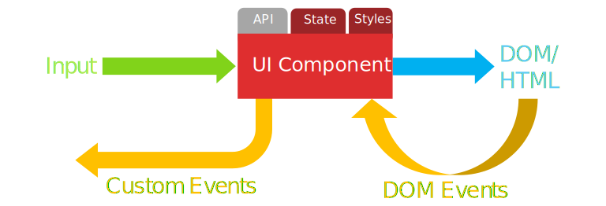

# Components

Marko makes it easy to create UI component that can be used as building blocks for constructing web pages and web applications of any complexity. Marko promotes creating self-contained UI components that are independently testable and that encapsulate the view, client-side behavior (e.g., event handling) and styling. UI components can easily be combined to create composite UI components. Marko UI components compile into small and efficient JavaScript modules that hide implementation details from outside users. Lastly, a Marko UI component can also be published to [npm](https://www.npmjs.com) so that it can be reused across applications.

## UI component diagram



With Marko, the DOM output of a UI component is based on input properties and a UI component may also maintain internal state that is used to control the view. If Marko detects a change to either input or to the internal state then the view (i.e., the DOM) will automatically be updated based on the new input and state. Internally, Marko uses virtual DOM diffing/patching to update the view, but this is an implementation detail that could change at any time.

## Component structure

Marko makes it easy to to co-locate your component's class and styles with the HTML view that they correspond to. The following are the key part of any UI component:

- __View__ - The HTML template for your UI component. Receives input properties and states and renders to either HTML (server-side) or virtual DOM nodes (browser-side)
- __Client-side behavior__ - Implemented as a JavaScript class with methods and properties to provide initialization, event handling (including DOM events, custom events and lifecycle events) and state management
- __Styling__ - Cascading StyleSheet with support for CSS preprocessors such as Less or Sass

## Server-side rendering

A UI component can be rendered on the server or in the browser, but in either case, the UI component instance will be mounted to a DOM node in the browser automatically. If a UI component tree is rendered on the server then Marko will automatically recreate the UI component tree in the browser with no extra code required. For more details, please see [Server-side rendering](/docs/server-side-rendering/).


## Single-file components

Marko allows you to define a `class` for a component right in the `.marko` view and call methods of that class with `on-*` attributes:

```marko
class {
    onCreate() {
        this.state = {
            count:0
        };
    }
    increment() {
        this.state.count++;
    }
}

<div>
  <h2>The current count is ${state.count}</h2>
  <button on-click('increment')>+1</button>
</div>
```

### Styles

Adding styles to your view is also made easy.  These styles won't be output in a `<style>` tag as inline styles usually are, but will result in the style being externalized so it isn't duplicated should a component be used more than once on the page.

```marko
style {
    button.primary {
        background-color:#09c;
    }
}

<div>
  <h2>The current count is ${state.count}</h2>
  <button on-click('increment')>+1</button>
</div>
```

If you use a css preprocessor, you can add the extension right on `style`:
```marko
style.less {
    button.primary {
        background-color: @primaryColor;
    }
}
```

> **Note:** The code in the style section is processed in a context that is separate from the rest of the template so so you won't be able to use JavaScript variables inside the style section. If you need variables in your CSS then you will need to use a CSS pre-processor that supports variables.


## Multi-file components

You might prefer to keep your component's class and style definitions in separate files from the view definition - the classical separation of HTML, CSS and JavaScript.  Marko makes this possible with a simple filename based convention.

> **ProTip:** If your motivation to move the component's class and styles out to a separate file is that the code is getting too large, consider splitting the component into smaller, more manageable components.

### Supporting files

Marko automatically discovers supporting files in the same directory as a Marko view.  For example if you have a view named `counter.marko`, Marko will automatically look for `counter.component.js` and `counter.style.css`.

```
counter.marko
counter.component.js
counter.style.css
```

Marko also handles views named `index.marko` specially, it will look for `component.js` and `style.css` in addition to `index.component.js` and `index.style.css`.  This allows easily grouping component files into a directory:

```
counter/
    index.marko
    component.js
    style.css
```

In your `component.js` file, export the component's class:

```js
module.exports = class {
    onCreate() {
        this.state = {
            count:0
        };
    }
    increment() {
        this.state.count++;
    }
}
```

In your `index.marko` file, you can reference methods from the class using `on-*` attributes:
```marko
<div>
  <h2>The current count is ${state.count}</h2>
  <button on-click('increment')>+1</button>
</div>
```

And in your `style.css`, define the style:
```css
button.primary {
    background-color:#09c;
}
```

> **ProTip:** In addition to looking for `[name].style.css`, Marko actually looks for `[name].style.*` so it will also pick up any css preprocessor you're using (less, stylus, scss, etc.).


### Components with plain objects

If you're targeting a browser that does not support classes, a plain object may also be exported:

```js
module.exports = {
    onCreate: function() {
        this.state = {
            count:0
        };
    },
    increment: function() {
        this.state.count++;
    }
}
```

## Split components

Split components allow you to optimize for the case where a component is rendered on the server, but doesn't need to be re-rendered in the browser.  Because the component doesn't need to be rendered in the browser, the template does not need to be sent to the browser.  This can reduce your page weight by a few hundred bytes in some cases.

> **Note:** If a split component is the child of a stateful component, the full rendering logic will still be sent down because the parent component may pass new input to the split component, requiring it to re-render.

Additionally if _all_ components rendered on a page are split components, Marko's VDOM and rendering runtime is not necessary and therefore not sent to the browser, which can further reduce page weight by a few kilobytes.

> **ProTip:** Don't over-optimize.  If your component really doesn't need re-rendering, go ahead and split, but don't forgo stateful re-rendering when it would make your code more maintainable.

### Usage

Marko discovers split components in a similar way to how it discovers an external component class:
for example if you have a view named `button.marko`, it will automatically look for `button.component-browser.js`.  If your view is named `index.marko`, it will look for `component-browser.js` in addition to `index.component-browser.js`.

```
counter/
    index.marko
    component-browser.js
```

A split component might also need to do some set up as part of the initial render.  In this case, the component may define a second component class to use the `onCreate`, `onInput`, and `onRender` [lifecycle methods](#lifecycle-events).  This class can be exported from `component.js` or defined right in the template as with single-file components.
### Example

_index.marko_
```marko
class {
    onCreate() {
        this.number = 123;
    }
}

<div on-click('shout')/>
```

_component-browser.js_
```js
module.exports = {
    shout() {
        alert('My favorite number is ' + this.number + '!');
    }
}
```

## Event handling

The `on-[event](methodName, ...args)` attribute allows an event listener to be attached for either a native DOM event (when used on a native DOM element such as a `<div>`) or a UI component event (when used on a custom tag for a UI component such as `<my-component>`. The `on-*` attribute is used to associate an event handler method with an event name. Attaching listeners for native DOM events and UI component custom events is explained in more detail in the sections below.

You may also use the `once-[event](methodName, ...args)` attribute, which will listen for only the first event, and then remove the listener for any subsequent events.

### Attaching DOM event listeners

The code below illustrates how to attach an event listener for a native DOM event:

```marko
class {
  onButtonClick(name, event, el) {
    alert(`Hello ${name}!`);
  }
  fadeIn(event, el) {
      // ... fade the image in
  }
}

<div>
  <button on-click('onButtonClick', 'Frank')>
    Say Hello to Frank
  </button>

  <button on-click('onButtonClick', 'John')>
    Say Hello to John
  </button>

  
</div>
```

Any string that represents a valid JavaScript identifier is allowed for the event handler method name and it can be a JavaScript expression. The following arguments are passed to the handler method when the event is fired:

1. `...args` - Any extra arguments bind are _prepended_ to the arguments passed to the component's handler method
    - For example: `on-click('onButtonClick', arg1, arg2)` → `onButtonClick(arg1, arg2, event, el)`)
2. `event` - The native DOM event
3. `el` - The DOM element that the event listener was attached to

When using the `on-*` or `once-*` attributes to attach event listeners, Marko will use event delegation that is more efficient than using `el.addEventListener()` directly. Please see [Why is Marko Fast? » Event delegation](/docs/why-is-marko-fast/#event-delegation) for more details.

<a name="declarative-custom-events"></a>

### Attaching custom event listeners

The code below illustrates how to attach an event listener for a UI component custom event:

```marko
class {
  onCounterChange(newValue, el) {
    alert(`New value: ${newValue}!`);
  }
  onCounterMax(max) {
      alert(`It reached the max: ${max}!`);
  }
}

<div>
  <counter on-change('onCounterChange') once-max('onCounterMax') />
</div>
```

Any string that represents a valid JavaScript identifier is allowed for the event handler method name and it can be a JavaScript expression. The following arguments are passed to the handler method when the event is fired:

1. `...args` - Any extra bind arguments are _prepended_ to the arguments passed to the component's handler method
2. `...eventArgs` - The arguments passed to `this.emit()` by the target UI component
3. `component` - The component instance that the event listener was attached to

The following code illustrates how the UI component for `<counter>` might emit the `change` event:


_counter/index.marko_
```marko
class {
  onCreate() {
    this.max = 50;
    this.state = { count: 0 };
  }
  increment() {
    if (this.state.count < this.max) {
        this.emit('change', ++this.state.count);
    }
    if (this.state.count === this.max) {
        this.emit('max', this.state.count);
    }
  }
}

<div>
  <button.example-button on-click('increment')>
    Increment
  </button>
</div>
```


> **ProTip:** Unlike native DOM events, UI component custom events may be emitted with multiple arguments. For example:

```js
this.emit('foo', 'bar', 'baz');
```

## Attributes

### `on-[event](methodName, ...args)`

The `on-*` attribute allows an event listener to be attached for either a native DOM event (when used on a native DOM element such as a `<div>`) or a UI component event event (when used on a custom tag for a UI component such as `<my-component>`. The `on-*` attribute is used to associate an event handler method with an event name. Please see the [Event handling](#event-handling) section above for more details on how to use the the `on-[event](methodName, ...args)` attribute.

### `once-[event](methodName, ...args)`

This is the same as the `on-*` attribute except that its listener will only be invoked for the first event, and then removed from memory after that. Please see the [Event handling](#event-handling) section above for more details on how to use the the `once-[event](methodName, ...args)` attribute.

### `key`

The `key` attribute can be used to obtain references to nested HTML elements and nested UI components. The `key` attribute is also used for matching corresponding elements together during DOM diffing/patching after a re-render. Internally, Marko assigns a unique key to all HTML elements and UI components in a `.marko` file based on the order that they appear in the file. If you have repeated elements or elements that move to different locations then you likely want to assign a custom `key`. The `key` attribute can be applied to both HTML elements and custom tags for UI components. Additionally, when updating the DOM, keyed elements and components are guaranteed to be matched up and reused rather than being discarded and re-created.

#### Referencing nested HTML elements and components

```marko
class {
  onMount() {
    var headerEl = this.getEl('header');
    var colorLIs = this.getEls('colors');
    var myFancyButton = this.getComponent('myFancyButton');
    // ...
  }
}
<div>
  <h1 key="header">Hello</h1>
  <ul>
    <for(color in ['red', 'green', 'blue'])>
        <li key="colors[]">${color}</li>
    </for>
  </ul>
  <fancy-button key="myFancyButton"/>
</div>
```

> **Note:** The `[]` suffix (e.g. `key="colors[]"`) is used let Marko know that the element will be repeated multiple times with the same key.

#### Keyed matching

The `key` attribute can be used to pair an HTML element or a UI component that moves to a new location in the DOM. For example:

```marko
class {
  onCreate() {
    this.state = {
      swapped: false
    }
  }
}

<if(state.swapped)>
  <div key="b">B</div>
  <div key="a">A</div>
</if>
<else>
  <div key="b">B</div>
  <div key="a">A</div>
</else>
```

The `key` attribute can be used to pair HTML elements or UI components that are repeated:

```marko
<ul>
  <for(users in input.users)>
      <li key=user.id>${user.name}</li>
  </for>
</ul>
```

#### `*:scoped`

Putting the `:scoped` modifier on an attribute will result in the attribute value being prefixed with a unique ID associated with the current UI component. Thus, `:scoped` attribute modifiers can be used to assign a globally unique attribute value from a value that only needs to be unique to the current UI component.

Certain HTML attributes reference the `id` of other elements on the page.  For example, the [HTML `<label>`](https://developer.mozilla.org/en-US/docs/Web/HTML/Element/label) `for` attribute takes an `id` as its value.  Many `ARIA` attributes ([`aria-describedby`](https://developer.mozilla.org/en-US/docs/Web/Accessibility/ARIA/ARIA_Techniques/Using_the_aria-describedby_attribute), etc.) also take an `id` as their value.

The `:scoped` modifier on an attribute allows you to reference another element as shown in the following examples:

**`for:scoped`**
```marko
<label for:scoped="name">Name</label>
<input id:scoped="name" value="Frank"/>
```

The above code will produce output HTML similar to the following:

```html
<label for="c0-name">Name</label>
<input id="c0-name" value="Frank">
```

**`aria-describedby:key`**

```marko
<button
   aria-label="Close"
   aria-describedby:scoped="descriptionClose"
   on-click('closeDialog')>X</button>
<div id:scoped="descriptionClose">
   Closing this window will discard any information entered and return you back to the main page
</div>
```

### `no-update`

Preserves the DOM subtree associated with the DOM element or component such that
it won't be modified when re-rendering the UI component.

```marko
<div>
    <!-- Don't ever re-render this table -->
    <table no-update>
        ...
    </table>
</div>
```

```marko
<div>
    <!-- Don't ever re-render this UI component -->
    <app-map no-update/>
</div>
```

### `no-update-if`

Similar to [no-update](#codeno-updatecode) except that the DOM subtree is
conditionally preserved:

```marko
<div>
    <!-- Don't ever re-render this table if the condition is met -->
    <table no-update-if(input.tableData == null)>
        ...
    </table>
</div>
```

### `no-update-body`

Similar to [no-update](#codeno-updatecode) except that only the child DOM nodes
are preserved:

```marko
<!-- Don't ever re-render any nested DOM elements -->
<div no-update-body>
    ...
</div>
```

### `no-update-body-if`

Similar to [no-update-body](#codeno-update-bodycode) except that only the child
DOM nodes are conditionally preserved:

```marko
<div>
    <!-- Don't ever re-render any nested DOM elements if the condition is met -->
    <table no-update-body-if(input.tableData == null)>
        ...
    </table>
</div>
```

### `:no-update`

Used to prevent select element attributes from being modified during a
re-render. The attribute that should not be modified should have a `:no-update`
suffix:

```marko
<!-- Don't ever modify the class attribute -->
<div class:no-update=input.className>
    ...
</div>
```

## Properties

### `this.el`

The root [HTML element](https://developer.mozilla.org/en-US/docs/Web/API/element) that the component is bound to.  If there are multiple roots, this is the first.

### `this.els`

An array of the root [HTML elements](https://developer.mozilla.org/en-US/docs/Web/API/element) that the component is bound to.

### `this.id`

The String ID of the root [HTML element](https://developer.mozilla.org/en-US/docs/Web/API/element) that the component is bound to.

### `this.state`

The current state for the component.  Changing `this.state` or any of its direct properties will result in the component being re-rendered.

Only properties that exist when `this.state` is first defined will be watched for changes.  If you don't need a property initially, you can set it to `null`.

```marko
class {
    onCreate() {
        this.state = {
            data: null,
            error: null
        }
    }
    getData() {
        fetch('/endpoint')
            .then(data => this.state.data = data)
            .catch(error => this.state.error = error);
    }
}
```

Be aware, that setting a `state` property only nominates the component for a possible rerender and properties are only watched one level deep. Thus, the component is only rerendered, if at least one of the component state properties changed (`oldValue !== newValue`).

If none of the properties changed (because identical or not detected by a shallow comparison), the assignment is considered a no operation (great for performance).

We recommend using [immutable](https://wecodetheweb.com/2016/02/12/immutable-javascript-using-es6-and-beyond/) data structures, but if you want to mutate a state property (perhaps push a new item into an array) you can mark it as dirty using `setStateDirty`.

```js
this.state.numbers.push(num);

// mark numbers as dirty, because a `push`
// won't be automatically detected by Marko
this.setStateDirty('numbers');
```

### `this.input`

The current input for the component. Setting `this.input` will result in the component being re-rendered. If a `$global` property is set the `out.global` will also be updated during the re-render, otherwise the existing `$global` is used.

## Variables

When a Marko component is compiled some additional variables are made available to the rendering function. These variables are described below.

### `component`

The `component` variable refers to the instance of the current UI component being rendered. This variable can be used to call methods on the UI component instance.

```marko
class {
    getFullName() {
        var person = this.input.person;
        return person.firstName + ' ' + person.lastName;
    }
}

<div>Hello ${component.getFullName()}</div>
```

### `input`

The `input` variable refers to the input object and is equivalent to `component.input`|`this.input`.

```marko
<div>Hello ${input.name}</div>
```

### `state`

The `state` variable refers to UI component's state object and is the unwatched equivalent of `component.state`|`this.state`.

```marko
<div>Hello ${state.name}</div>
```

## Methods

### `destroy([options])`

| option  | type | default | description |
| ------- | ---- | ------- | ----------- |
| `removeNode` | `Boolean` | `true` | `false` will keep the component in the DOM while still unsubscribing all events from it |
| `recursive` | `Boolean` | `true` | `false` will prevent child components from being destroyed |

Destroys the component by unsubscribing from all listeners made using the `subscribeTo` method and then detaching the component's root element from the DOM. All nested components (discovered by querying the DOM) are also destroyed.

```javascript
component.destroy({
	removeNode: true, //true by default
	recursive: true //true by default
})
```

### `forceUpdate()`

Queue the component to re-render and skip all checks to see if it actually needs it.

> When using `forceUpdate()` the updating of the DOM will be queued up. If you want to immediately update the DOM
> then call `this.update()` after calling `this.forceUpdate()`.

### `getEl([key, index])`

| params  | type | description |
| ------- | ---- | ----------- |
| `key` | `String` | _optional_ the scoped identifier for the element |
| `index` | `Number` | _optional_ the index of the component, if `key` references a repeated component |
| return value | `HTMLElement` | the element matching the key or `this.el` if no key is provided |

Returns a nested DOM element by prefixing the provided `key` with the component's ID. For Marko, nested DOM elements should be assigned an ID using the `key` custom attribute.

### `getEls(key)`

| params  | type | description |
| ------- | ---- | ----------- |
| `key` | `String` | the scoped identifier for the element |
| return value | `Array<HTMLElement>` | an array of _repeated_ DOM elements for the given key |

Repeated DOM elements must have a value for the `key` attribute that ends with `[]` (e.g., `key="items[]"`)

### `getElId([key, index])`

| params  | type | description |
| ------- | ---- | ----------- |
| `key` | `String` | _optional_ the scoped identifier for the element |
| `index` | `Number` | _optional_ the index of the component, if `key` references a repeated component |
| return value | `String` | the element ID matching the key or `this.el.id` if `key` is undefined |

Similar to `getEl`, but only returns the String ID of the nested DOM element instead of the actual DOM element.

### `getComponent(key[, index])`

| params  | type | description |
| ------- | ---- | ----------- |
| `key` | `String` | the scoped identifier for the element |
| `index` | `Number` | _optional_ the index of the component, if `key` references a repeated component |
| return value | `Component` | a reference to a nested `Component` for the given key. If an `index` is provided and the target component is a repeated component (e.g. `key="items[]"`) then the component at the given index will be returned. |

### `getComponents(key, [, index])`

| params  | type | description |
| ------- | ---- | ----------- |
| `key` | `String` | the scoped identifier for the element |
| `index` | `Number` | _optional_ the index of the component, if `key` references a repeated component |
| return value | `Array<Component>` | an array of _repeated_ `Component` instances for the given key |

Repeated components must have a value for the `key` attribute that ends with `[]` (e.g., `key="items[]"`)

### `isDestroyed()`

Returns `true` if a component has been destroyed using
[`component.destroy()`](#codeondestroycode), otherwise `false`.

### `isDirty()`

### `replaceState(newState)`

| params  | type | description |
| ------- | ---- | ----------- |
| `newState` | `Object` | a new state object to replace the previous state |

Replaces the state with an entirely new state. Equivalent to `this.state = newState`.

> **Note:** While `setState()` is additive and will not remove properties that are in the old state but not in the new state, `replaceState()` will add the new state and remove the old state properties that are not found in the new state. Thus, if `replaceState()` is used, one must consider possible side effects if the new state contains less or other properties than the replaced state.

### `rerender([input])`

| params  | type | description |
| ------- | ---- | ----------- |
| `input` | `Object` | _optional_ new input data to use when re-rendering |

Rerenders the component using its `renderer` and either supplied `input` or internal `input` and `state`.

### `setState(name, value)`

| params  | type | description |
| ------- | ---- | ----------- |
| `name` | `String` | the name of the state property to update |
| `value` | `Any` | the new value for the state property |

Used to change the value of a single state property.  Equivalent to setting `this.state[name] = value` except it will also work for adding new properties to the component state.

```javascript
this.setState('disabled', true);
```

### `setState(newState)`

| params  | type | description |
| ------- | ---- | ----------- |
| `newState` | `Object` | a new state object to merge into the previous state |

Used to change the value of multiple state properties.

```js
this.setState({
	disabled: true,
	size: 'large'
});
```

### `setStateDirty(name[, value])`

| params  | type | description |
| ------- | ---- | ----------- |
| `name` | `String` | the name of the state property to mark as dirty |
| `value` | `Any` | _optional_ a new value for the state property |

Force a state property to be changed even if the value is equal to the old value. This is helpful in cases where a change occurs to a complex object that would not be detected by a shallow compare. Invoking this function completely circumvents all property equality checks (shallow compares) and always rerenders the component.

#### More details

The first parameter `name` is used to allow update handlers (e.g. `update_foo(newValue)`) to handle the state transition for the specific state property that was marked as dirty. The second parameter `value` is used as the new value that is given to update handlers. Because `setStateDirty()` always bypasses all property equality checks, this parameter is optional. If not given or equal to the old value, the old value will be used for the update handler.
It is important to know, that the given parameters do not affect how or if `setStateDirty()` rerenders a component; they are only considered as additional information to update handlers.

_example.js_

```javascript
// Because this does not create a new array, the change
// would not be detected by a shallow property comparison
this.state.colors.push('red');

// Force that particular state property to be considered dirty so
// that it will trigger the component's view to be updated
this.setStateDirty('colors');
```

### `subscribeTo(emitter)`

| params  | description |
| ------- | ----------- |
| `emitter` | a node.js [`EventEmitter`](https://nodejs.org/api/events.html#events_class_eventemitter) or a DOM object that emits events (`window`, `document`, etc.) |
| return value | a tracked subscription |

When a component is destroyed, it is necessary to remove any listeners that were attached by the component in order to prevent a memory leak.  By using `subscribeTo`, Marko will automatically track and remove any listeners you attach when the component is destroyed.

Marko uses [`listener-tracker`](https://github.com/patrick-steele-idem/listener-tracker) to provide this feature.

_example.js_
```js
this.subscribeTo(window).on('scroll', () => {
    console.log('The user scrolled the window!');
});
```

### `update()`

Immediately, executes any pending updates to the DOM rather than following the normal queued update mechanism for rendering.

```js
this.setState('foo', 'bar');
this.update(); // Force the DOM to update
this.setState('hello', 'world');
this.update(); // Force the DOM to update
```

## Event methods

A Marko component inherits from [`EventEmitter`](https://nodejs.org/api/events.html#events_class_eventemitter).  Below are a few commonly used methods, view the node docs for the full list.

### `emit(eventName, ...args)`

| params  | type | description |
| ------- | ---- | ----------- |
| `eventName` | `String` | the name of the event |
| `...args` | `Any` | all subsequent parameters are passed to the listeners |

Emits a UI component custom event. If a UI component attached a listener with the matching `eventName` then the corresponding event listener method will be automatically invoked. Event listeners can be attached using either the [`on-[event](methodName, ...args)` attribute](#declarative-custom-events) attribute or `targetComponent.on()`.

### `on(eventName, handler)`

| params  | type | description |
| ------- | ---- | ----------- |
| `eventName` | `String` | the name of the event to listen for |
| `handler` | `Function` | the function to call when the event is fired |

Adds the listener function to the end of the listeners array for the event named eventName. No checks are made to see if the listener has already been added. Multiple calls passing the same combination of eventName and listener will result in the listener being added, and called, multiple times.

### `once(eventName, handler)`

| params  | type | description |
| ------- | ---- | ----------- |
| `eventName` | `String` | the name of the event to listen for |
| `handler` | `Function` | the function to call when the event is fired |

Adds a one time listener function for the event named eventName. The next time eventName is triggered, this listener is removed and then invoked.

## Lifecycle events

Marko defines six distinct lifecycle events:

- `create`
- `input`
- `render`
- `mount`
- `update`
- `destroy`

These events are emitted at specific points over the lifecycle of a component as shown below:

**First render**

```js
emit('create') → emit('input') → emit('render') → emit('mount')
```

**New input**

```js
emit('input') → emit('render') → emit('update')
```

**Internal state change**

```js
emit('render') → emit('update')
```

**Destroy**

```js
emit('destroy')
```

### Lifecycle event methods

Each lifecycle event has a corresponding component lifecycle method that can be used to listen for the event:

```js
class {
  onCreate(input, out) { }
  onInput(input, out) { }
  onRender(out) { }
  onMount() { }
  onUpdate() { }
  onDestroy() { }
}
```

> **ProTip:** When a lifecycle event occurs in the browser, the corresponding event is emitted on the component instance.  A parent component, or other code that has access to the component instance, can listen for these events. For example:
```js
component.on('input', function(input, out) {
    // The component was destroyed!
});
```

### `onCreate(input, out)`

| params  | description |
| ------- | ----------- |
| `input` | the input data used to render the component for the first time |
| `out`   | the async `out` used to render the component for the first time |

The `create` event is emitted (and `onCreate` is called) when the component is first created.

`onCreate` is typically used to set the initial state for stateful components:

_example.marko_
```marko
class {
    onCreate(input) {
        this.state = { count: input.initialCount };
    }
}

// ...
```

### `onInput(input, out)`

| params  | description |
| ------- | ----------- |
| `input` | the new input data |

The `input` event is emitted (and `onInput` is called) when the component receives input: both the initial input and for any subsequent updates to its input.

### `onRender(out)`

| params  | description |
| ------- | ----------- |
| `out`   | the async `out` for the current render |

The `render` event is emitted (and `onRender` is called) when the component is about to be rendered (or re-rendered).

### `onMount()`

The `mount` event is emitted (and `onMount` is called) when the component is first mounted to the DOM.  For a server-rendered component, this is the first event that is emitted in the browser.

This is the first point at which `this.el` and `this.els` are defined.  `onMount` is commonly used to attach third-party javascript (or `jQuery` if you're still doing that) plugins to the newly-mounted DOM element(s).

For example, attaching a library that monitors whether the component is in the viewport:

_example.marko_
```marko
import scrollmonitor from 'scrollmonitor';

class {
    onMount() {
        this.watcher = scrollmonitor.create(this.el);
        this.watcher.enterViewport(() => console.log('I have entered the viewport'));
        this.watcher.exitViewport(() => console.log('I have left the viewport'));
    }
}

// ...
```

### `onUpdate()`

The `update` event is emitted (and `onUpdate` is called) when the component is called after a component has re-rendered and the DOM has been updated.  If a re-render does not cause the DOM to be updated (nothing changed), this event will not be fired.

### `onDestroy()`

The `destroy` event is emitted (and `onDestroy` is called) when the component is about to be unmounted from the DOM and cleaned up.  `onDestroy` should be used to do any additional clean up beyond what Marko handles itself.

For example, cleaning up from our `scrollmonitor` example in [`onMount`](#codeonmountcode):

_example.marko_

```marko
import scrollmonitor from 'scrollmonitor';

class {
    onMount() {
        this.watcher = scrollmonitor.create(this.el);
        this.watcher.enterViewport(() => console.log('Entered the viewport'));
        this.watcher.exitViewport(() => console.log('Left the viewport'));
    }
    onDestroy() {
        this.watcher.destroy();
    }
}

// ...
```

## DOM manipulation methods

The following methods move the component's root DOM node(s) from the current parent element to a new parent element (or out of the DOM in the case of `detach`).

### `appendTo(targetEl)`

Moves the UI component's DOM elements into the position after the target element's last child.

```js
this.appendTo(document.body);
```

### `detach()`

Detaches the component's root element(s) from the DOM by removing the UI component's DOM elements from its parent node.

### `insertAfter(targetEl)`

Moves the UI component's DOM elements into the position after the target DOM element.

### `insertBefore(targetEl)`

Moves the UI component's DOM elements into the position before the target DOM element.

### `prependTo(targetEl)`

Moves the UI component's DOM elements into the position before the target element's first child.

### `replace(targetEl)`

Replaces the target element with the UI component's DOM elements.

### `replaceChildrenOf(targetEl)`

Replaces the target elements children with the UI component's DOM elements.
