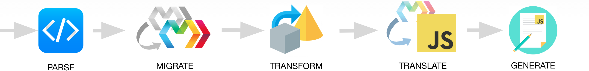

# Compiler

> **Warning**:
> The compiler API and hooks are not terribly stable. They’re intended for advanced integrations or userland experimentation with new language features.
>
> Prefer existing official plugins and the standard tag library when possible.

## Compile API

> **Warning**:
> The Compile API is intended for advanced integration with build tools, like Webpack and Rollup. Unless you’re doing that, you probably instead want [`build`/`serve` in the Marko CLI](https://github.com/marko-js/cli#readme), or one of [Marko’s bundler integrations](https://markojs.com/docs/bundler-integrations-overview/).

### Compile Functions

Compile functions take two arguments:

1. A source Marko template
2. [`CompileOptions`](#options)

Then, they return a `CompileResult`:

```ts
type CompileResult = {
  code: string;
  map?: SourceMap;
  meta: Record<string, unknown>;
};
```

- `code`: The compiled output of executable JavaScript code.
- `map`: [A source map, used for debugging.](https://firefox-source-docs.mozilla.org/devtools-user/debugger/how_to/use_a_source_map/index.html)
- `meta`: Metadata gathered while compiling — nothing terribly useful, probably going to get deprecated.
  - Data about child dependencies. Was useful back when it was primarily the bundlers that handled tree-shaking out server components. Now that happens in the compiler, so we don’t use this anymore and therefore might become inaccurate in the future.
  - A list of `watchFiles`: files that were used to compile the template (e.g. `marko.json`). Used to tell bundlers which files should be watched in dev mode.

#### `compileFile()` and `compileFileSync`

```ts
compiler.compileFile(filename: string, options?: CompileOptions): Promise<CompileResult>
compiler.compileFileSync(filename: string, options?: CompileOptions): CompileResult
```

`compileFile` and `compileFileSync` load `filename` from disk to use as a source template, then translate it into JavaScript.

```js
import * as compiler from "@marko/compiler";

const asyncResult = await compiler.compileFile("./src/index.marko", {
  modules: "cjs"
});
const syncResult = compiler.compileFileSync("./src/index.marko", {
  modules: "cjs"
});
```

#### `compile()` and `compileSync()`

```ts
compiler.compile(src: string, filename: string, options?: CompileOptions): Promise<CompileResult>
compiler.compileSync(src: string, filename: string, options?: CompileOptions): CompileResult
```

`compile` and `compileSync` accept source templates as a string, rather than loading from disk.

The `filename` location is used for resolving taglibs and imports, but does not have to be an actually existing file. <!-- TODO: should it be renamed to baseFile or importBase or something? -->

```js
import * as compiler from "@marko/compiler";

const asyncResult = await compiler.compile(
  "<h1>Hello!</>",
  "./src/index.marko",
  { modules: "cjs" }
);
const syncResult = compiler.compileSync("<h1>Hello!</>", "./src/index.marko", {
  modules: "cjs"
});
```

### Options

The compiler may be configured globally to change its default options:

```js
import * as compiler from "@marko/compiler";
compiler.configure({ output: "dom" });
```

Or you can pass options objects when calling compile functions. Each property will override individual properties set by `configure()`:

```js
import * as compiler from "@marko/compiler";
compiler.configure({
  output: "dom",
  sourceMaps: true
});
const result = compiler.compileFileSync("./example.marko", {
  output: "html"
});
```

In the above example, `result` would be compiled with the options of `{ output: "html", sourceMaps: true }`.

#### `output`

Type: `string`<br>
Default: `"html"`

- `"html"`: compiles templates to JavaScript that generates HTML strings for server HTTP responses, writing `.html` files, or maybe even constructing `Response`s in Web Workers.
- `"dom"`: compiles templates to JavaScript that generates DOM nodes for client-side rendering in browsers.
- `"hydrate"`: like `"dom"`, but only includes assets & components needed in-browser, assuming the page was rendered on the server.
- `"migrate"`: only runs migrations (no transforms or translation) and returns the migrated template code.
- `"source"`: parses templates without running any migrations or transforms. (Useful with `ast: true`)

> **Note**:
> For `dom` or `hydrate` outputs, you should also specify a [`resolveVirtualDependency`](#resolvevirtualdependency) function.

#### `code`

Type: `boolean`<br>
Default: `true`

If `false`, will not generate or return the compiled `code` string.

#### `ast`

Type: `boolean`<br>
Default: `false`

If `true`, the compiler will provide the `ast` in its output.

#### `stripTypes`

Type: `boolean|undefined`<br>
Default: `undefined`

If `true`, removes all TypeScript types from the output.
If the value is `undefined` (the default), the compiler will remove types if the `output` option is not `source` or `migrate`.

For example, to run migrations _and_ strip types, you can set both `output: "migrate"` and `stripTypes: true`.

#### `runtimeId`

Type: `string`<br>
Default: `undefined`

Optionally use to override the runtime ID used to differentiate multiple copies of Marko on the same page, which is passed to `marko/components.init(runtimeId)` when compiling in the `hydrate` output.

#### `writeVersionComment`

Type: `boolean`<br>
Default: `true`

Whether the Marko version should be written to the template in a comment, like so:

```js
// Compiled using marko@x.x.x - DO NOT EDIT
```

#### `ignoreUnrecognizedTags`

Type: `boolean`<br>
Default: `false`

Whether unrecognized tags should be silently ignored or throw a compile error. Ignored tags will be output as native elements.

> **ProTip**:
> Some test setups use this alongside `@marko/compiler/taglib`'s `excludeDir` and `excludePackage` to simulate "shallow" rendering.

#### `sourceMaps`

Type: `boolean` or `string`<br>
Default: `false`

Whether source maps should be output with the compiled templates.

- When `true` a `map` property will be available on the compile result.
- When `"inline"` the sourcemap will be inlined as a comment in the output code.
- When `"both"` both of the above will be used.

#### `meta`

Type: `boolean`<br>
Default: `false`

_Deprecated_. This option inlines the metadata in the output Javascript code. Metadata should be accessed instead from the `CompileResult`.

#### `fileSystem`

Type: typeof [`fs`](https://nodejs.org/api/fs.html) (specifically read APIs)<br>
Default: Cached `fs`

Use a different file system object (eg. webpack's [CachedInputFileSystem](https://github.com/webpack/enhanced-resolve/blob/f08fe3f1a22c90c722eca14b38a9300ad00c62e8/lib/CachedInputFileSystem.js) or [`arc-fs`](https://github.com/eBay/arc/tree/master/packages/arc-fs))

#### `modules`

Type: `string` (`"esm"` or `"cjs"`)<br>
Default: `"esm"`

By default Marko outputs ES Modules. You can optionally specify `"cjs"` for CommonJS/`require()`.

#### `optimize`

Type: `boolean`<br>
Default: [environment based](https://github.com/marko-js/marko/blob/0f212897d2d3ec30b12c2f18ba950818bccb83b4/packages/compiler/src/babel-plugin/index.js#L277-L284) (`false` in development, `true` in production)

Enables production mode optimizations.

#### `resolveVirtualDependency`

Type:

```ts
(
  filename: string,
  dep: {
    code: string;
    virtualPath: string;
    map?: SourceMap;
  }
) => string;
```

Default: `undefined`

This option should be set for `dom` or `hydrate` outputs. Since Marko templates can represent multiple output files (eg. JS renderer and CSS styles), a single source `.marko` file must be treated as potentially multiple virtual files.

Different build tools have different mechanisms for handling virtual files. You should pass a function that returns a virtual path that can be handled by your build tool.

##### Example based on `@marko/webpack/loader`:

```js
// lookup is shared between resolveVirtualDependency and markoLoader
const virtualSources = new Map();

function resolveVirtualDependency(filename, { virtualPath, code, map }) {
  const virtualFilename = `${filename}?virtual=${virtualPath}`;

  // Add virtual source to the lookup to be later accessed by the loader
  virtualSources.set(virtualFilename, { code, map });

  // Generate the webpack path, from right to left...
  // 1. Pass the virtualFilename so webpack can find the real file
  //    located at sourceFilename, but the virtualPath is also present
  //    (eg. "./index.marko?virtual=./index.marko.css")
  // 2. Use an inline loader to run this file through @marko/webpack/loader
  //    https://webpack.js.org/concepts/loaders/#inline
  // 3. Use an inline matchResource to redefine this as the virtualPath
  //    which allows the appropriate loaders to match the virtual dependency
  //    https://webpack.js.org/api/loaders/#inline-matchresource
  return `${virtualPath}!=!@marko/webpack/loader!${virtualFilename}`;
}

export default function markoLoader(source) {
  let code, map;

  if (virtualSources.has(this.resource)) {
    // If the resource has a ?virtual query param, we should
    // find it in the lookup and then return the virtual code
    // rather than performing the normal compilation
    { code, map } = virtualSources.get(this.resource);
    virtualSources.delete(this.resource);
  } else {
    // The default behavior is to compile the template in dom output mode
    { code, map } = markoCompiler.compileSync(source, this.resourcePath, {
      output: "dom",
      resolveVirtualDependency
    });
  }

  return this.callback(null, code, map);
}
```

#### `hydrateIncludeImports`

This option is only used for `output: "hydrate"`. By default, `import`s in server-only files are not included in the hydrate output. However, for some assets, like stylesheets, it is useful to have them included in hydrate mode.

The `hydrateIncludeImports` option allows you to provide a function which receives an import path, or a regexp to match against that path which tells Marko to include that import in the hydrate mode output.

The default regexp includes a list of common known asset file extensions, and is as follows:

```js
/\.(css|less|s[ac]ss|styl|png|jpe?g|gif|svg|ico|webp|avif|mp4|webm|ogg|mp3|wav|flac|aac|woff2?|eot|[ot]tf)$/;
```

Looking at a partial Marko file such as:

```marko
import "./bar"
import "./foo.css";
import "./baz.wasm";

<div/>
```

For `hydrate` output, with the default `hydrateIncludeImports`, would only cause `./foo.css` to be loaded in the browser.

#### `cache`

Type: typeof [`Map`](https://developer.mozilla.org/en-US/docs/Web/JavaScript/Reference/Global_Objects/Map) (specifically, `.get()` is required)<br>
Default: `new Map()`

Compiling a Marko template may require other (used) Marko templates to compile. To prevent compiling templates more than once, most of the compilation is cached.

The default cache strategy is to clear the cache each macrotask. If the default cache is overwritten, it is up to the user to determine when the cache is cleared.

#### `babelConfig`

Type: see [babel options](https://babeljs.io/docs/en/options)<br>
Default: babel defaults, plus

```js
{
  filename,
  sourceType: "module",
  sourceMaps: config.sourceMaps
}
```

#### `translator`

Type: `{ analyze: Visitor, transform:Visitor }`<br>
Default: [autodiscovers](https://github.com/marko-js/marko/blob/0f212897d2d3ec30b12c2f18ba950818bccb83b4/packages/compiler/src/config.js#L46-L89) a translator package starting with `@marko/translator-` or `marko-translator-`

The translator is a collection of transforms that translates the Marko AST into a valid JavaScript AST based on the `output` option. There is a default translator in Marko, but this option may be used to switch to experimental translators for alternate runtimes.

The translator is an object with `analyze` and `transform` [Babel Visitors](https://github.com/jamiebuilds/babel-handbook/blob/master/translations/en/plugin-handbook.md#visitors):

- The result of the `analyze` visitor is cached and may be requested by other templates.
- The `transform` visitor transforms the AST to its final JavaScript AST.

See [`@marko/translator-default`](https://github.com/marko-js/marko/blob/11a10f82cdb5389880e6deca5f77d17727acb831/packages/translator-default/src/index.js) for a reference implementation.

## Hooks

> **Note**:
> These compiler hooks aren’t terribly stable either. Using hooks for one-time migrations, like a codemod, is the best-supported way to use the compiler hooks, since you won’t have to worry about the code changing underneath you in the future.



The Marko compiler runs a series of stages to produce its final JavaScript output. These stages handle different steps of template processing, and can be tweaked, extended, and hooked into with [`marko.json` configuration files](./marko-json.md).

- All compiler hooks must have a default export of a [Babel-style visitor function](https://github.com/jamiebuilds/babel-handbook/blob/master/translations/en/plugin-handbook.md#toc-visitors), which will receive a [babel `NodePath`](https://github.com/jamiebuilds/babel-handbook/blob/master/translations/en/plugin-handbook.md#paths) with a `MarkoTag` node.

- Hooks will also receive a `types` object that matches the [`@babel/types`](https://babeljs.io/docs/en/babel-types) API extended with the [Marko AST types](#marko-ast). (You may also reference the types by importing `{ types } from "@marko/compiler"`.)

- Hooks may alternatively export an `enter` function (alias of `default`), and optionally an `exit` function. These map to [`@babel/traverse`’s `enter` and `exit` methods](https://github.com/jamiebuilds/babel-handbook/blob/master/translations/en/plugin-handbook.md#babel-traverse).

Here is an example hook:

```js
export default (tag, types) => {
  if (types.isStringLiteral(tag.node.name)) {
    console.log(`Found a tag called ${tag.node.name.value}`);
    tag.remove();
  }
};
```

### Parse

Marko compilation starts by converting the raw text of your Marko template into an [AST (Abstract Syntax Tree)](https://en.wikipedia.org/wiki/Abstract_syntax_tree) — an object representation of your code.

```marko
<h1>Hello!</h1>
```

…will roughly become:

```json
{
  "type": "MarkoTag",
  "name": {
    "type": "StringLiteral",
    "value": "h1"
  },
  "body": {
    "type": "MarkoTagBody",
    "body": [
      {
        "type": "MarkoText",
        "value": "Hello!"
      }
    ]
  }
}
```

This might look a bit verbose, but ASTs aim for completeness, not terseness.

Marko parses in two steps to stay flexible with the ever-changing syntax of JavaScript:

1. The first parsing pass happens in our [`htmljs-parser`](https://github.com/marko-js/htmljs-parser), which understands the HTML and HTML-like parts of your template.

2. For JavaScript expressions, Marko defers to [`@babel/parser`](https://babeljs.io/docs/en/babel-parser). The resulting [Marko AST](#marko-ast) is a superset of what `@babel/parser` would return.

To hook into the `parse` stage, use [the `parse` option in the `marko.json` file](https://markojs.com/docs/marko-json/#paths).

> **Note**: The `parse` hook deviates from the other compiler hooks:
>
> - It does not support the `enter` & `exit` API.
> - You _must return_ a replacement AST node.

### Migrate

That’s right, Marko has _first-class_ support for migrations. The **migration stage** can translate outdated APIs into modern counterparts, leaving the rest of the compilation none the wiser.

Migrations run automatically in the background, and can be written to disk when users are ready by running the [`@marko/migrate` CLI command](https://github.com/marko-js/cli/blob/master/packages/migrate/README.md).

To hook into the `migrate` stage, [use the `migrate` option in the `marko.json` file](https://markojs.com/docs/marko-json/#paths).

> **Note:**
> To make the compiler stop at this point and output the migrated template, rather than continuing to produce the JavaScript output, [set `output: "migrate"`](#output) in the [compilation options](#options).

### Transform

The **transform stage** is meant for userland transformations of Marko code into different Marko code. Think of it like [`babel.transform`](https://babeljs.io/docs/en/babel-core#transform) for Marko templates.
At this stage, you are given a fully parsed and migrated AST to do what you will with.

To hook into the `transform` stage, [use the `transform` option in the `marko.json` file](https://markojs.com/docs/marko-json/#paths).

### Analyze

Next is the **analyze stage**, intended for non-mutative analysis of the entire AST in a way that can be cached in RAM.

> **Note**:
> “Non-mutative analysis” means that if you modify the AST during this stage, _you’ll probably regret it_ someday.

Metadata should be stored on nodes’ `.extra` property. These `.extra` properties are typically read in [the translate stage](#translate), or when using the child template analysis helpers.

To hook into the `analyze` stage, [use the `analyze` option in the `marko.json` file](https://markojs.com/docs/marko-json/#paths).

### Translate

Finally, we have the **translation stage**. This stage is Marko’s “Rosetta Stone”, and is responsible for turning your beautiful `.marko` code into different versions of optimized JavaScript you’d rather not write yourself.

To hook into the `translate` stage, [use the `translate` option in the `marko.json` file](https://markojs.com/docs/marko-json/#paths).

## Utilities

[The `@marko/babel-utils` package](https://github.com/marko-js/marko/tree/master/packages/babel-utils/index.d.ts) exposes a handful of utilities for various tasks on [Marko ASTs](#marko-ast).

### Marko AST

Marko extends Babel’s AST types to add nodes for `MarkoTag`, `MarkoAttribute`, etc.

For AST creation and assertion utilities, you can import Marko’s `@babel/types` superset from the compiler package:

```js
import { types } from "@marko/compiler";
```

The [`@babel/types` documentation](https://babeljs.io/docs/en/babel-types) shows all utility methods available for Babel AST nodes. When importing `types` from `@marko/compiler`, you also get the same types of utilities for Marko nodes: `types.markoTag`, `types.isMarkoTag`, `types.assertMarkoTag`, and so on.

For full definitions, view the source code for Babel and Marko:

- [Babel’s Core Definitions](https://github.com/babel/babel/blob/master/packages/babel-types/src/definitions/core.js)
- [Babel’s Extended Definitions](https://github.com/babel/babel/tree/master/packages/babel-types/src/definitions)
- [Marko’s Definitions](https://github.com/marko-js/marko/blob/master/packages/compiler/src/babel-types/types/definitions.js)
